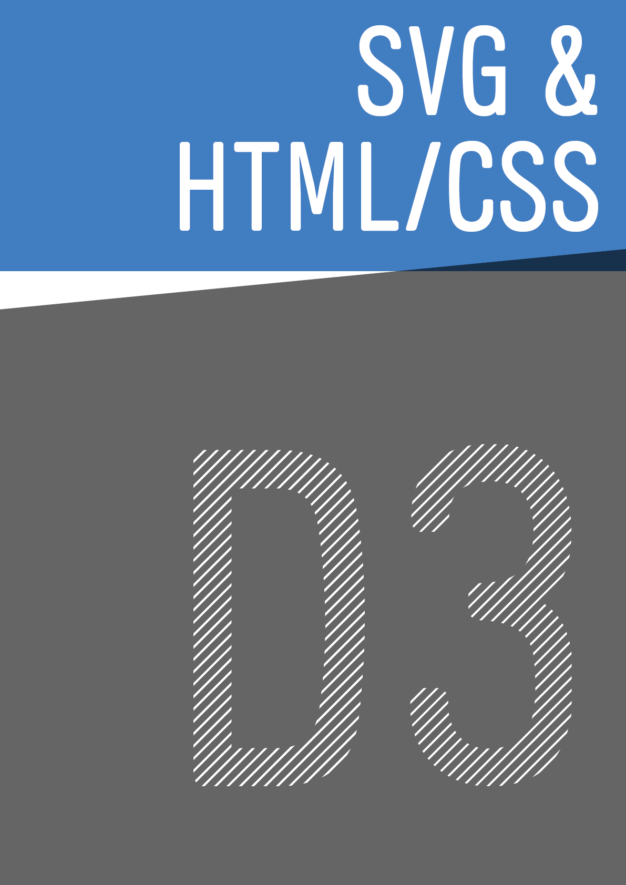
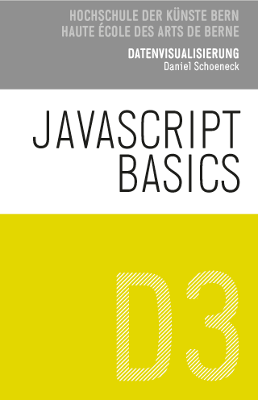
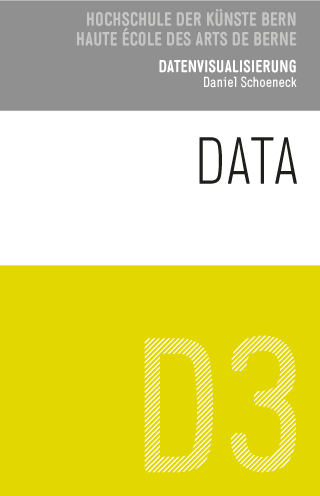
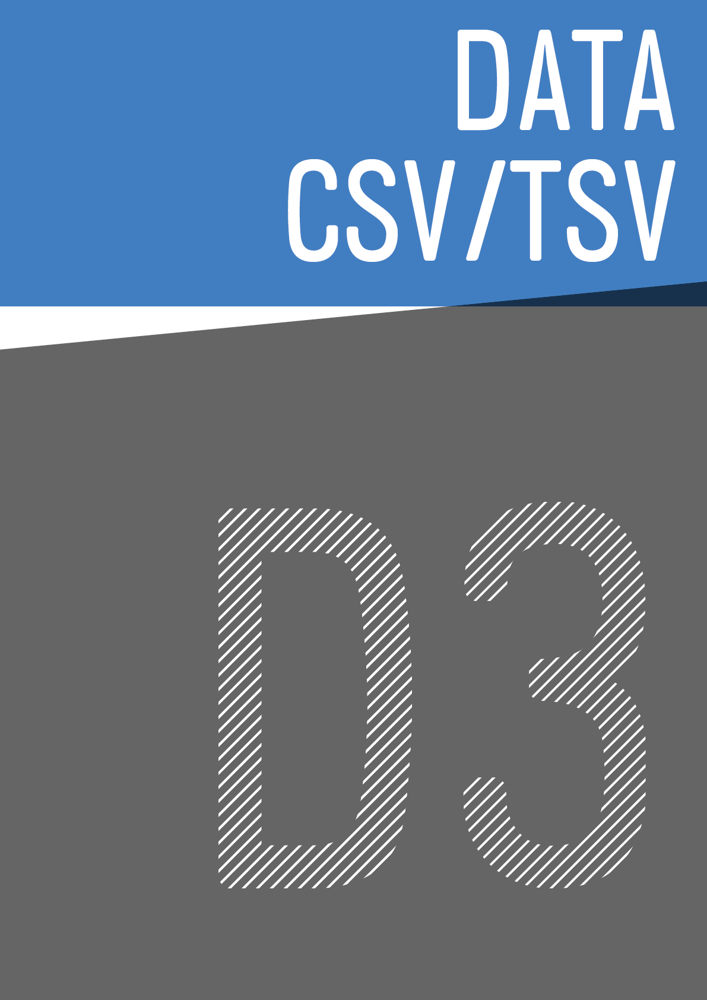
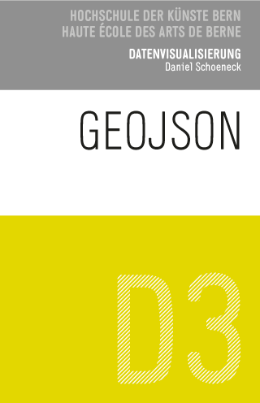
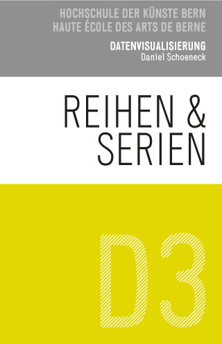
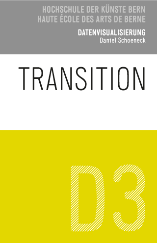

# HKB CAS Datenvisualisierung
### Data Driven Documents mit D3.js
Der CAS Datenvisualisierung ist eine interdisziplinär und medienübergreifend ausgerichtete Weiterbildung. Vermittelt werden Grundlagen, Theorie und Methoden des Informationsdesigns. Im Zentrum steht das Gestalten von Informationsgrafiken, Diagrammen und Schaubildern.

&nbsp;
&nbsp;
&nbsp;
&nbsp;
&nbsp;
&nbsp;
&nbsp;
&nbsp;
&nbsp;

#### Inhalt:
1. <a href="_L0/">D3 Up & Going</a>&nbsp;
2. <a href="basics.md">SVG & HTML/CSS</a>&nbsp;
3. <a href="basics.md">Javascript Basics</a>&nbsp;
4. <a href="basics.md">Data</a>&nbsp;
5. <a href="basics.md">Data CSV/TSV</a>&nbsp;
6. <a href="basics.md">Skalen & Achsen</a>&nbsp;
7. <a href="basics.md">GeoJSON</a>&nbsp;
8. <a href="basics.md">Reihen & Serien</a>&nbsp;
9. <a href="basics.md">Transition</a>&nbsp;
10. <a href="basics.md">Updating Data</a>

Diese Serie liefert eine grundlegende Einführung in die Datenvisualisierung mit d3.js.
Die Beispiele sind im Quelltext kommentiert, weiterführendes Material dazu ist vorhanden.

### Arbeitsgrundlagen
* [Brackets](http://brackets.io) - Code Editor
* [Sublime Text](https://www.sublimetext.com/) - Code Editor
* [Subethaedit](https://www.codingmonkeys.de/subethaedit/) - Code Editor
* [Coda2](https://panic.com/coda/) - Code Editor
* [Text Wrangler](http://www.barebones.com/products/textwrangler/) - Code Editor
* [LibreOffice](https://de.libreoffice.org/) - Verarbeitung von Daten des OGD Portals
* [R, Rstudio](https://www.rstudio.com) - Datenaufbereitung
 
Weitere Atom, UltraEdit, BBedit, Bluefish, etc…
Dazu ein sinnvolles Tool um die Konvertierung von Zeilenenden und Encodierung vorzunehmen (CSV/TSV etc.)

Sinnvolle Erweiterungen für Brackets:
  - Brackets Color Picker (https://github.com/mikailcolak/brackets-color-picker)
  - HTML Skeleton (https://github.com/le717/brackets-html-skeleton)
  - Beautify (https://github.com/dingdong-io/brackets.beautify.io)
  - Brackets Git (https://github.com/zaggino/brackets-git)
  - Emmet (http://emmet.io)

&nbsp;

---

### Next: <a href="_L0/">Up & Going</a>

[Übersicht](#chapter)
