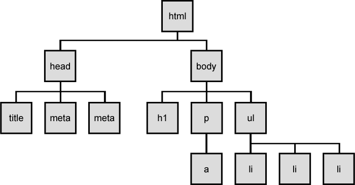

# SVG  & HTML/CSS

D3.js ist 100% Webstandards bezogen. Grundkenntnisse **HTML/CSS** sind deshalb von Vorteil, ebenso Vertrautheit mit der Logik von **XML** und 'Scalable Vector Graphics' **SVG**.<br>
D3 ist eine Javascript Library, d.h. Programmierumgebung vollständig JS (ES5 - Stand Juni 2016).


####Das hier…####



####…bildet diese Dokumentenstruktur ab:####
```html
<!DOCTYPE html>
<html lang="de">
<head>
    <meta charset="utf-8">
    <meta name="viewport" content="width=device-width, initial-scale=1.0">
    <title>HTML Dokument Crash Kurs</title>
</head>

<body>
    <h1>A dozen direct censures are easier to bear than one morganatic compliment.</h1>
    <p>Der Begriff <a href='http://de.wikipedia.org/wiki/Morganatische_Ehe'>morganatisch</a> geht auf die morganatische Ehe zurück. Als morganatische Ehe (lat. matrimonium morganaticum, mittellateinische Neubildung zu althochdeutsch morgangeba, «Morgengabe») oder Ehe zur linken Hand bezeichnet man eine im europäischen Adel nicht selten vorkommende Form der Ehe, bei der einer der beiden Ehepartner (meistens die Frau) von niedrigerem Stand war als der andere (Nichtebenbürtigkeit).</p>
    <ul>
        <li>Mark Twain, from Pudd'nhead Wilson's New Calendar in Following the Equator (1897)</li>
        <li>morganatic, from latin "matrimonium morganaticum"</li>
        <li>Zu deutsch, morganatisch: unaufrichtig, linkisch, zweifelhaft, fragwürdig</li>
    </ul>
</body>
</html>
```


#Crash Kurs HTML/CSS#


Kommentar zum Material

###File: [L1-01.html](L1-01.html)###
Unstrukturierter Content, Dokument mit minimalem Markup, Text

<p>&nbsp;</p>
###File: [L1-02.html](L1-02.html)###
####Strukturierung mit HTML####
Semantische Struktur dort, wo möglich und sinnvoll.<br>
D.h. Überschrift wird zu Überschrift (`<h1>` bzw. `<h2>`, `<h3>`, `<h4>`, `<h5>`, `<h6>`)<br> 
Absatz wird zu Absatz (`<p>`) etc. <br> Übersicht in der HTML-Referenz: https://developer.mozilla.org/de/docs/Web/HTML/Element<br>
`<div>` als generisches Element wird generell dort eingesetzt, wo nicht-semantische Verpackung/Gliederung/Struktur gewünscht ist.

<p>&nbsp;</p>
###File: [L1-03.html](L1-03.html)###
####Variante: Strukturierung mit HTML####
Die Bildung von Struktur unterliegt einzig und allein der Regel, dass valider (= allgemein gültiger) HTML Code entsteht. Das bedeutet, dass zur Auszeichnung des Dokuments (HTML = Hypertext Markup Language = Hypertext Auszeichnungssprache ) alles erlaubt ist, was gültig ist, man also relativ frei ist, diese selber zu bestimmen.
Hier eine Variante, die minimal anders aufgebaut ist, sich jedoch semantisch unterscheidet.
Ein standardkonformer Browser veranlasst das, Unterschiede in Textgrösse für h1 zu rendern (siehe Textgrösse im `<h1>` zu [L1-02.html](L1-02.html) im direkten Vergleich)

        


<p>&nbsp;</p>
###File: [L1-04.html](L1-04.html)###
####Strukturierung mit HTML, gestalterischer Eingriff mit CSS####
Jetzt kann CSS kommen. Drei Möglichkeiten CSS einzubinden und zu verwenden: 

1. direkt im Dokument, über `<style type="text/css"> … </style>` im `<head>`
2. verlinkt auf ein Dokument, über `<link rel="stylesheet" href=" … " type="text/css">` im `<head>`
3. Inline, als Attribut, über `<p style="color: deeppink;"> </p>` direkt dem Element zugewiesen


<p>&nbsp;</p>
###File: [L1-05.html](L1-05.html)###
####DOM-Traversierung und Selektion####
<a href="dom_tree.png"></a>&nbsp;Präzise, d.h. gezielt selektieren heisst:  Attribute "class" und "id" vergeben
Ein Element kann zu zwei (drei, vier, …) Klassen gehören, jedoch nur eine ID haben.
CSS kann so gezielt Elemente ansprechen ( *und um nichts anderes geht es hier!* )
dabei gilt folgende CSS Syntax:
#####mit:
* Zeichen: __. (Punkt)__ | Der Punkt wird als Klassen-Selektor interpretiert <br>Beispiel: `<p class="testKlasse">` wird in CSS über `.testKlasse { … }`selektiert

* Zeichen: __# (Hash)__ | Der Hash wird als ID-Selektor interpretiert <br>Beispiel: `<p id="testID">` wird in CSS über `#testID { … }`selektiert

* __ohne__ | Selektiert generische Elemente (auch SVG) <br>Beispiel: `<body>`, `<p>`, `<h1>`, `<span>`


<p>&nbsp;</p>
###File: [L1-06.html](L1-06.html)###
####Strukturierung mit HTML####
Semantische Struktur dort, wo möglich und sinnvoll.<br>
D.h. Überschrift wird zu Überschrift (`<h1>` bzw. `<h2>`, `<h3>`, `<h4>`, `<h5>`, `<h6>`)<br> 
Absatz wird zu Absatz (`<p>`) etc. <br> Übersicht in der HTML-Referenz: https://developer.mozilla.org/de/docs/Web/HTML/Element<br>
`<div>` als generisches Element wird generell dort eingesetzt, wo nicht-semantische Verpackung/Gliederung/Struktur gewünscht ist.


<p>&nbsp;</p>
###File: [L1-07.html](L1-07.html)###
####Strukturierung mit HTML####
Semantische Struktur dort, wo möglich und sinnvoll.<br>
D.h. Überschrift wird zu Überschrift (`<h1>` bzw. `<h2>`, `<h3>`, `<h4>`, `<h5>`, `<h6>`)<br> 
Absatz wird zu Absatz (`<p>`) etc. <br> Übersicht in der HTML-Referenz: https://developer.mozilla.org/de/docs/Web/HTML/Element<br>
`<div>` als generisches Element wird generell dort eingesetzt, wo nicht-semantische Verpackung/Gliederung/Struktur gewünscht ist.


<p>&nbsp;</p>

---


### [Next:](../_L1/)

[Übersicht](../README.md#chapter)
